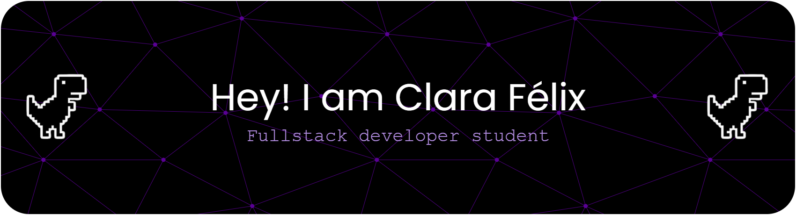

   

  

  

   

 

## Sobre mim 
Graduanda em Sistemas de Informação com foco em me tornar desenvolvedora web full stack. Busco aprender coisas novas, colaborar em equipe e sempre evoluir, tanto pessoal quanto profissionalmente. Meu objetivo é desenvolver minhas habilidades, participar de projetos que façam a diferença e construir uma carreira sólida no mundo da tecnologia.

 

---

- 📍Natal, RN  
  

- 🖥️ Sistemas de Informação   
  

- 🏫 Universidade Potiguar   
  

- 📚 Atualmente estudando: Desenvolvimento Web, Análise de dados e Mobile

- 🎨 Experiência com Design (UX/UI)

---

   

## Linguagens e ferramentas

  
  
  
  
  
  
  
  
  
  
  
  
  
  

  

   

## Github Stats  
<table><tr><td valign="top" width="50%">

</td><td valign="top" width="50%">

</td></tr></table>  

   

